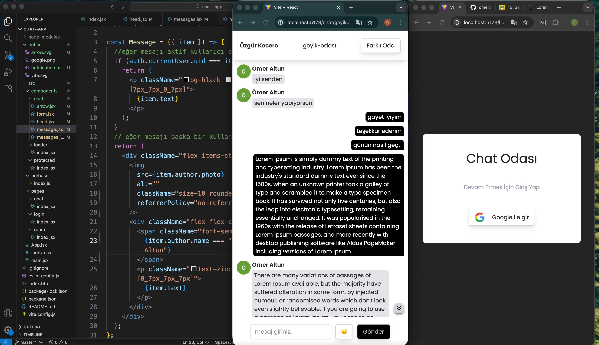

# 💬 Chat App (Real-Time Messaging)

A modern, real-time chat application where users can log in via Google and message each other in dynamic rooms.

## 🚀 Features

Google Authentication: Quick and secure login using Firebase Auth.

Real-time Messaging: Instant message delivery powered by Firestore onSnapshot.

Dynamic Room System: Create or join custom chat rooms easily.

Protected Routes: Secure access control that redirects unauthenticated users to the login page.

Emoji Support: Integrated emoji-picker-react for expressive messaging.

Smart Auto-Scroll: Automatically scrolls to the latest message and tracks unread counts.

## 🛠️ Technologies

Frontend: React 19, Vite

Backend & DB: Firebase (Firestore & Auth)

Styling: Tailwind CSS v4

State & Routing: React Router Dom v7

Notifications: React Toastify

# 💬 Chat App

Bu proje, kullanıcıların Google hesaplarıyla giriş yapıp farklı odalarda gerçek zamanlı mesajlaşabildiği modern bir sohbet uygulamasıdır.

## 🚀 Özellikler (Features)

Google Auth: Firebase Authentication ile hızlı ve güvenli giriş.

Real-time Messaging: Firestore onSnapshot ile anlık mesaj iletimi.

Room System: Dinamik oda oluşturma ve odalara katılma.

Protected Routes: Oturum açmamış kullanıcıların mesajlara erişimini engelleyen korumalı rotalar.

Emoji Support: Mesajlara kolayca emoji ekleme desteği.

Auto Scroll: Yeni mesaj geldiğinde otomatik aşağı kaydırma ve okunmamış mesaj bildirimi.

## 🛠️ Teknolojiler (Technologies)

Frontend: React 19, Vite

Backend & DB: Firebase (Firestore & Auth)

Styling: Tailwind CSS v4

State & Routing: React Router Dom v7

Notifications: React Toastify

## Ekran Görüntüsü

## GIFS

